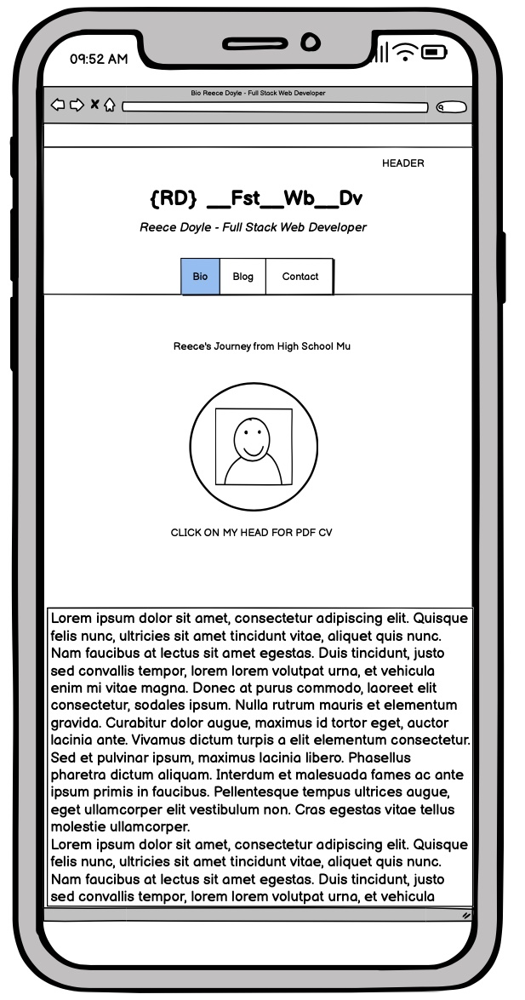
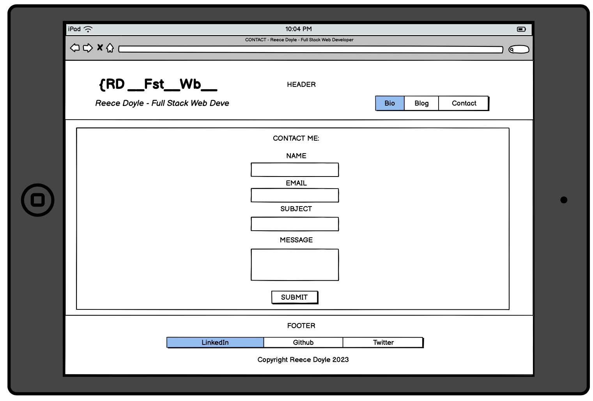
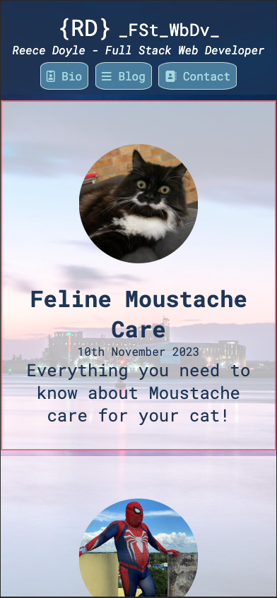

# Reece Doyle T1A2 Portfolio Assignment 

## Index
1. [Published Protfolio Website](https://main--lively-starburst-c0200f.netlify.app/)
2. [Github Repository](https://github.com/reecewdoyle/RDT1A2)
3. [Presentation Video](https://youtu.be/C2e5m2Xio6w)
4. [Purpose](#purpose)
5. [Target Audience](#target-audience)
6. [Functionality and Features](#functionality-and-features)

    6.1 [Homepage](#homepage)

    6.2 [Bio Page](#bio-page)

    6.3 [Blog Index](#blog-index)

    6.4 [Blog Post](#blog-post)

    6.5 [Contact Page](#contact-page)

7. [Sitemap](#sitemap) 

8. [Wireframes](#wireframes)
    
    8.1 [Homepage Wireframe](#homepage-wireframe)

    8.2 [Bio page Wireframe](#bio-page-wireframe)

    8.3 [Blog Index Wireframe](#blog-index-wireframe)

    8.4 [Blog Post Wireframe](#blog-post-wireframe)

    8.5 [Contact Page Wireframe](#contact-page-wireframe)

9. [Screenshots](#screenshots)

    9.1 [Homepage Screenshots](#homepage-screenshots)

    9.2 [Bio Page](#bio-page-screenshots)

    9.3 [Blog Index Screenshots](#blog-index-screenshots)

    9.4 [Blog Post Screenshots](#blog-post-screenshots)

    9.5 [Contact Page Screenshots](#contact-page-screenshots)

10. [Tech Stack](#tech-stack)
***
## Purpose

The purpose of this website is to be a hub that displays the following information in one place:

 * My contact details
 * A contact form for people that want me to contact them
 * A bio page with a link to my CV that can be downloaded as a PDF
 * A blog page with a list of blogs
 * Five Blog posts

This website is also an expression of my personality. Every element of the website has something meaningful about me to display, from the colour palette to the intenionally humourous nature of the articles and lighthearted tone of the copy.

 [Back to index](#index)
 ***
 ## Target Audience

 The target audience for this website is potential employers in the IT industry. The goal was to be engaging and memorable, entertaining, and informative. I wanted display my level of competance and attention to detail along with an expression of my sense of humour. This is to commuicate that I can both be effective and pleasent to work with.

 [Back to index](#index)
 ***

## Functionality and Features
### Homepage
The hompage establishes the colour palette, theme and layout of the website. The features that are across all pages include:

- Favicon of "RD" used across all pages.

- Transparent Header with a Navbar and logo that links to the homepage.

- Transparent Footer with icon links to my LinkedIn profile, GitHub profile, and X page. 
- Background picture of Newcastle Harbour.

- Transparent white background for article sections.

- A circular image, which becomes common accross all images throughout the website.

- The logo and icons in the header and footer transition from white to blue on hover.

 - The buttons in the navigation bar transition from light blue to navy blue on hover.

Features that are unique to the Homepage include:

- Greeting section (which forms the basis for the article sections used throughout the rest of the website).

- Contacts section with my phone number and email address. The phone number should be clickable on most mobile phones. 

 [Back to index](#index)
 ***

### Bio Page

The bio page contains:

- A very tongue-in-cheek about section generated by ChatGPT detailing my past as a High School Music Teacher, Musician and my "side hustle" as a "friendly neighbourhood spiderman".

- A cirular portrait of myself that is also a clickable link to a PDF of my CV.

 [Back to index](#index)
 ***

### Blog Index

The blog index contains:

- 5 blogs articles as clickable links in list form.

- Each blog article has a picture, title, date, and subtitle.

- The blog articles get a red border on hover.

 [Back to index](#index)
 ***

### Blog Post
Each blog post contains:

- A large humourous image that adds meaning and context to the article.

- A satirical or article generated by ChatGPT.

- A Navbar to facilitate moving through the blog posts or returning to the blog index.

 [Back to index](#index)
 ***

### Contact Page
The contact page contains:
- A simple contact form requesting:
    - Name
    - Email
    - Subject
    - Message

 [Back to index](#index)
 ***

### Sitemap

The sitemap is divided into 4 parts for simplicity.
 - The main sitemap (top left) shows the navigation between Homepage, Bio page, Blog index and Contact Page.

 - The blog index (bottom left)shows the interconection between each blog post and and blog index.

 - The Header (top right) shows what is available on the navbar.

 - The Footer (bottom right) shows the links to my social pages. 

 [Back to index](#index)
 ***

### Wireframes
*Note: I've included 'top' and 'bottom' versions of pages that don't fit into the viewport. This is to be very explicit with respect to what will be displayed.*
#### Homepage Wireframe
Homepage - Desktop

Homepage - Tablet

Homepage - Mobile

 [Back to index](#index)
 ***
#### Bio Page Wireframe
Bio Page - Desktop - Top

Bio Page - Desktop - Bottom

Bio Page - Tablet - Top

Bio Page - Tablet - Bottom

Bio Page - Mobile - Top

Bio Page - Mobile - Bottom

 [Back to index](#index)
 ***
#### Blog Index Wireframe
Blog Index - Desktop - Top

Blog Index - Desktop - Bottom

Blog Index - Tablet - Top

Blog Index - Tablet - Bottom

Blog Index - Mobile - Top

Blog Index - Mobile - Bottom

 [Back to index](#index)
 ***
#### Blog Post Wireframe
Blog Post - Desktop - Top

Blog Post - Desktop - Bottom

Blog Post - Tablet - Top

Blog Post - Tablet - Bottom

Blog Post - Mobile - Top

Blog Post - Mobile - Bottom

 [Back to index](#index)
 ***
#### Contact Page Wireframe
Contact Page - Desktop

Contact Page - Tablet

Contact Page - Mobile

 [Back to index](#index)
 ***

### Screenshots
*Note: as with the Wireframes, I have also included both a top and bottom screenshot where appropriate.*
### Homepage Screenshots
Homepage - Desktop

Homepage - Tablet

Homepage - Mobile

 [Back to index](#index)
 ***
### Bio Page Screenshots
Bio Page - Desktop - Top

Bio Page - Desktop - Bottom

Bio Page - Tablet - Top

Bio Page - Tablet - Bottom

Bio Page - Mobile - Top

Bio Page - Mobile - Bottom

 [Back to index](#index)
 ***
 ### Blog Index Screenshots
 Blog Index - Desktop - Top
 
 Blog Index - Desktop - Bottom
 
 Blog Index - Tablet - Top
 
 Blog Index - Tablet - Bottom
 
 Blog Index - Mobile - Top
 
 Blog Index - Mobile - Bottom
 

 [Back to index](#index)
 ***

 ### Blog Post Screenshots
 Blog Post - Desktop - Top
 
 Blog Post - Desktop - Bottom
 
 Blog Post - Tablet - Top
 
 Blog Post - Tablet - Bottom
 
 Blog Post - Mobile - Top
 
 Blog Post - Mobile - Bottom
 

 [Back to index](#index)
 ***

 ### Contact Page Screenshots
 Contact Page - Desktop
 
 Contact Page - Tablet
 
 Contact Page - Mobile
 

 [Back to index](#index)
 ***

 ## Tech stack

- HTML
- CSS
- SCSS
- Wireframes: [Balsamiq](https://balsamiq.com/ )
- Sitemap: [Draw.io](http://draw.io)
- Colour Palette: [Coolor.co](http://coolor.co)
- Deployment: [Netlify](https://www.netlify.com/)
- Version Control: [Github](https://github.com/)
- Code Editor: VS Code Editor
- Favicon Generator: [Favicon.cc](https://www.favicon.cc/)
- Image Optomisation: MacOS X Preview
- Slidedeck: Microsoft Powerpoint

 [Back to index](#index)
 ***